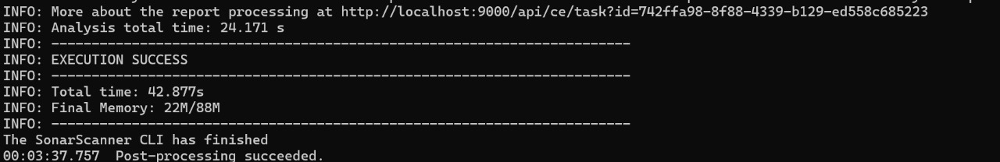
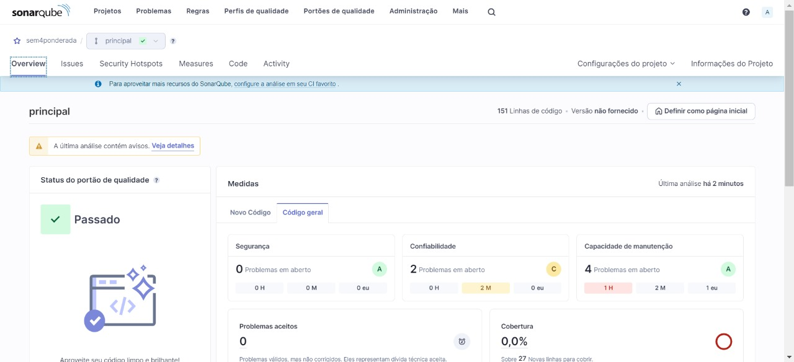

# M09-SEM4-PROG-SQ

#### Questão
Realize o passo a passo do artigo e armazene o seu código em um repositório git. Crie um relatório em markdown com um resumo explicando a tecnologia, os conceitos aprendidos. Adicione prints com o código em execução.

#### Resposta
TECNOLOGIA 
- SonarQube: Uma ferramenta de análise estática de código.
- .NET: Uma plataforma de desenvolvimento de software da Microsoft.
- C#: Uma linguagem de programação usada principalmente no ecossistema .NET.

CONCEITOS APRENDIDOS

1- SonarQube: Uma ferramenta de análise estática de código que ajuda a detectar problemas de qualidade de código, vulnerabilidades de segurança e padrões de código inadequados.

2- Integração do SonarQube com Projetos .NET: Aprenda como integrar o SonarQube com projetos desenvolvidos na plataforma .NET, permitindo a análise e melhoria da qualidade do código.

3- Análise Estática de Código: Compreenda a importância da análise estática de código na detecção de bugs, vulnerabilidades e problemas de desempenho em um projeto de software.

4- Métricas de Qualidade de Código: Explore as métricas fornecidas pelo SonarQube para avaliar a qualidade do código, como complexidade ciclomática, cobertura de código, duplicações de código e muito mais.

5- Melhoria Contínua da Qualidade do Código: Aprenda como usar as informações fornecidas pelo SonarQube para orientar a equipe de desenvolvimento na implementação de melhores práticas de codificação e na melhoria contínua da qualidade do código.

IMAGENS

